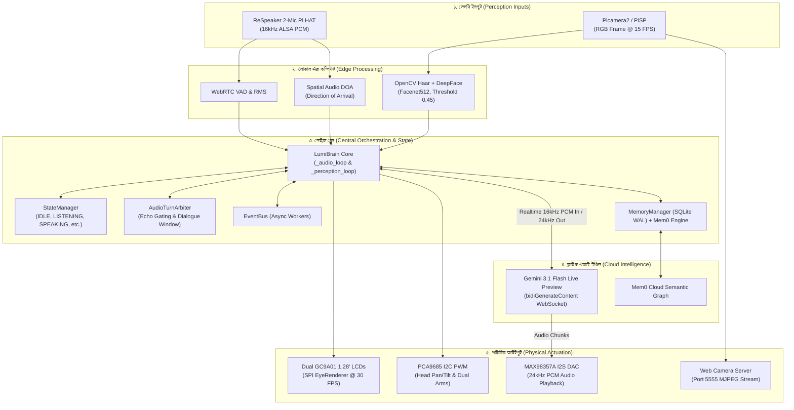

# 🌟 LUMI AI Companion Robot — Master System Guide & Architecture
> **Comprehensive Technical Blueprint & Operations Manual**  
> *Target Hardware: Raspberry Pi 5 | AI Engine: Google Gemini Live 3.1 Flash Preview | Primary Language: Bengali (বাংলা)*  
> *Last Updated: September 2026 | Version: 0.1.0 ("Grok Build")*

---

## 📑 সূচিপত্র (Table of Contents)
1. [প্রজেক্ট পরিচিতি ও দর্শন (Project Vision & Philosophy)](#১-প্রজেক্ট-পরিচিতি-ও-দর্শন-project-vision--philosophy)
2. [হাই-লেভেল সিস্টেম আর্কিটেকচার (System Architecture)](#২-হাই-লেভেল-সিস্টেম-আর্কিটেকচার-system-architecture)
3. [হার্ডওয়্যার স্পেসিফিকেশন ও ওয়্যারিং পিনআউট (Hardware Blueprint & Pinout)](#৩-হার্ডওয়্যার-স্পেসিফিকেশন-ও-ওয়্যারিং-পিনআউট-hardware-blueprint--pinout)
4. [কোডবেজ ও ফাইল স্ট্রাকচার (Codebase Directory & Modules)](#৪-কোডবেজ-ও-ফাইল-স্ট্রাকচার-codebase-directory--modules)
5. [কগনিশন ও এআই ইঞ্জিন: "Grok Build" (Cognition, Gemini Live & Prompts)](#৫-কগনিশন-ও-এআই-ইঞ্জিন-grok-build-cognition-gemini-live--prompts)
6. [অডিও পাইপলাইন, ইকো ও বার্জ-ইন আর্কিটেকচার (Audio Loop & Acoustic Feedback)](#৬-অডিও-পাইপলাইন-ইকো-ও-বার্জ-ইন-আর্কিটেকচার-audio-loop--acoustic-feedback)
7. [পারসেপশন ও মেমোরি সিস্টেম (Vision, Face Recognition & Mem0)](#৭-পারসেপশন-ও-মেমোরি-সিস্টেম-vision-face-recognition--mem0)
8. [১৮-ধাপের বুট সিকোয়েন্স (18-Step Boot Pipeline in main.py)](#৮-১৮-ধাপের-বুট-সিকোয়েন্স-18-step-boot-pipeline-in-mainpy)
9. [অপারেশন ও ট্রাবলশুটিং গাইড (Runbook & Troubleshooting)](#৯-অপারেশন-ও-ট্রাবলশুটিং-গাইড-runbook--troubleshooting)

---

## ১. প্রজেক্ট পরিচিতি ও দর্শন (Project Vision & Philosophy)

**LUMI (লুমি)** সাধারণ কোনো স্মার্ট স্পিকার (যেমন Google Home বা Alexa) বা স্ক্রিন-বেসড চ্যাটবট নয়। এটি একটি **Physical Autonomous Robot Companion** (শারীরিক স্বায়ত্তশাসিত রোবট সঙ্গী)।

### মূল স্তম্ভসমূহ:
* **শারীরিক উপস্থিতি (Embodiment):** দুটি বৃত্তাকার LCD চোখের প্রসিডিউরাল অ্যানিমেশন এবং ৩-অ্যাক্সিস সার্ভো মেকানিজম (মাথা ও দুই হাত)-এর মাধ্যমে জীবন্ত অনুভূতি প্রকাশ করে।
* **চোখ ও দৃষ্টি (Active Vision):** ব্যবহারকারীর মুখ শনাক্ত (Face Recognition) করে পরিচিত মানুষদের নাম ধরে সম্বোধন করা এবং পরিবেশ পর্যবেক্ষণ করা।
* **প্রাকৃতিক রিয়েল-টাইম কথোপকথন (Live Bi-directional Voice):** ওয়েক-ওয়ার্ডের বাটন চাপা ছাড়াই স্বাভাবিক মানুষের মতো একটানা শোনা এবং কথা বলা।
* **ব্যক্তিত্ব ("Grok-Style"):** চাটুকারহীন, বুদ্ধিদীপ্ত, রসাত্মক (playful wit & roasting) এবং খাঁটি বাংলায় কথা বলার সক্ষমতা।
* **স্মৃতিশক্তি (Episodic & Relational Memory):** লোকাল SQLite ডেটাবেস এবং ক্লাউড Mem0 ভেক্টর ইঞ্জিনের মাধ্যমে দীর্ঘমেয়াদি স্মৃতি সংরক্ষণ।

---

## ২. হাই-লেভেল সিস্টেম আর্কিটেকচার (System Architecture)



---

## ৩. হার্ডওয়্যার স্পেসিফিকেশন ও ওয়্যারিং পিনআউট (Hardware Blueprint & Pinout)

LUMI রাস্পবেরি পাই ৫-এর লো-লেটেন্সি বাসে হার্ডওয়্যার নিয়ন্ত্রণ করে:

### ক. কন্ট্রোলার ও প্রসেসিং
* **মাদারবোর্ড:** Raspberry Pi 5 (8GB RAM, Broadcom BCM2712, 64-bit Arm Cortex-A76 @ 2.4GHz)।
* **অপারেটিং সিস্টেম:** Raspberry Pi OS Bookworm (Debian 12/13, 64-bit)।

### খ. ডিসপ্লে সাব-সিস্টেম (Dual GC9A01 1.28" Round LCDs)
দুটি গোল ডিসপ্লে লুমির বাম ও ডান চোখ হিসেবে কাজ করে:
* **ইন্টারফেস:** SPI বাস 0 (SPI0)
* **রেজোলিউশন:** ২৪০ × ২৪০ পিক্সেল (প্রতি চোখ) @ ৩০ FPS
* **কন্ট্রোল লাইব্রেরি:** `lgpio` ও `spidev` (SPI স্পিড: 24MHz)
* **পিন ম্যাপিং:**
  * **বাম চোখ (Left Eye):** SPI Device 0, `DC=GPIO 24`, `RST=GPIO 25`, `BL=GPIO 18`
  * **ডান চোখ (Right Eye):** SPI Device 1, `DC=GPIO 23`, `RST=GPIO 22`, `BL=GPIO 18`

### গ. সার্ভো ড্রাইভার ও কাইনেম্যাটিক্স (PCA9685 I2C PWM)
* **ইন্টারফেস:** I2C বাস 1 (`0x40`), ৫০Hz PWM ফ্রিকোয়েন্সি
* **চ্যানেল ম্যাপিং (`lumi/config/hardware_config.yaml`):**
  * `Channel 0` (Head Tilt): `-15°` (Up) থেকে `+15°` (Down), Home: `0°`
  * `Channel 1` (Right Arm Y - Front/Back): `-60°` (Front) থেকে `+25°` (Back)
  * `Channel 2` (Left Arm Y - Front/Back): `-25°` (Back) থেকে `+60°` (Front)
  * `Channel 3` (Right Arm X - Up/Down): `-25°` (Up) থেকে `+5°` (Down)
  * `Channel 4` (Left Arm X - Up/Down): `-5°` (Down) থেকে `+25°` (Up)
  * `Channel 5` (Head Pan / Waist): `-90°` (Right) থেকে `+90°` (Left)

### ঘ. অডিও ইনপুট ও আউটপুট
* **মাইক্রোফোন:** Waveshare / ReSpeaker 2-Mic Pi HAT (I2S ইন্টারফেস, 16000Hz 16-bit Mono capture)।
* **স্পিকার:** MAX98357A I2S Mono DAC Amplifier (3W 4Ω স্পিকার ড্রাইভার)।
  * `BCLK`: GPIO 18
  * `LRCLK`: GPIO 19
  * `DOUT`: GPIO 21

### ঙ. ক্যামেরা
* **মডিউল:** Raspberry Pi Camera Module 3 (Picamera2 / PiSP হার্ডওয়্যার ইমেজ সিগন্যাল প্রসেসর)।
* **ক্যাপচার সাইজ:** 640 × 480 @ 15 FPS।

---

## ৪. কোডবেজ ও ফাইল স্ট্রাকচার (Codebase Directory & Modules)

```
Antigravity/
├── lumi/
│   ├── main.py                 # [BOOT] ১৮-ধাপের মাস্টার অ্যাপ্লিকেশন বুট ও রানটাইম
│   ├── config/
│   │   ├── default_config.yaml # মাস্টার সিস্টেম কনফিগারেশন (অডিও, ডিসপ্লে, মোশন, ভিশন)
│   │   └── hardware_config.yaml# পিনআউট, সার্ভো অ্যাঙ্গেল লিমিট ও আই২এস ম্যাপিং
│   ├── core/
│   │   ├── lumi_brain.py       # [BRAIN] সেন্ট্রাল কো-অর্ডিনেটর (_audio_loop, _perception_loop)
│   │   ├── state_manager.py    # বিহেভিয়ার স্টেট মেশিন (IDLE, LISTENING, SPEAKING, ইত্যাদি)
│   │   └── event_bus.py        # অ্যাসিনক্রোনাস পাবলিশ-সাবস্ক্রাইব ইভেন্ট বাস
│   ├── ai/
│   │   ├── gemini_live.py      # [GEMINI LIVE] Bidi WebSocket ক্লায়েন্ট (3.1 Flash Live Preview)
│   │   ├── prompts.py          # [GROK PERSONA] Grok-স্টাইলের সিস্টেম প্রম্পট ও আঞ্জুম মোড
│   │   └── tools.py            # ফাংশন কলিং ও এক্সটার্নাল টুলস
│   ├── audio/
│   │   ├── mic.py              # ALSA 16kHz PCM ক্যাপচার
│   │   ├── speaker.py          # ALSA I2S অডিও প্লেব্যাক ও is_playing ট্র্যাকিং
│   │   ├── turn_arbiter.py     # ইকো শিল্ড, কনভারসেশন টার্ন উইন্ডো ও বার্জ-ইন গেটিং
│   │   ├── spatial.py          # ReSpeaker ফেজ ডিফারেন্স ও DOA ক্যালকুলেটর
│   │   └── vad.py              # WebRTC ভয়েস অ্যাক্টিভিটি ডিটেকশন
│   ├── eyes/
│   │   └── renderer.py         # ৩০ FPS প্রসিডিউরাল চোখের অ্যানিমেশন ও এক্সপ্রেশন ইঞ্জিন
│   ├── hardware/
│   │   ├── display_driver.py   # GC9A01 LCD-র জন্য lgpio/spidev ড্রাইভার
│   │   └── servo_driver.py     # PCA9685 I2C কমিউনিকেশন
│   ├── motion/
│   │   ├── servo_controller.py # স্মুথ সার্ভো মুভমেন্ট ও অটো-রিল্যাক্স
│   │   └── gestures.py         # মাথা নাড়ানো, হাত নাড়ানো (Hello/Greeting/Nodding)
│   ├── vision/
│   │   ├── camera.py           # Picamera2 ব্যাকএন্ড
│   │   ├── face.py             # OpenCV Haar Cascade + DeepFace (কসমেটিক মিল 0.45)
│   │   ├── chess.py            # দাবা বোর্ড ও ঘুঁটি বিশ্লেষণ মডিউল
│   │   └── plant.py            # গাছের পাতার রোগ নির্ণয়
│   ├── memory/
│   │   ├── database.py         # SQLite WAL ডেটাবেস
│   │   ├── manager.py          # ইউজার প্রোফাইল ও ইন্টারঅ্যাকশন হিস্ট্রি
│   │   └── mem0_engine.py      # Mem0 ক্লাউড ভেক্টর সার্চ ও সিম্যান্টিক রিকল
│   └── web/
│       └── camera_server.py    # পোর্ট ৫৫৫৫-এ লাইভ এমজেপিইজি ক্যামেরা স্ট্রিমার
├── data/
│   ├── lumi.db                 # লোকাল SQLite ডেটাবেস
│   └── haarcascade_*.xml       # ফেস ডিটেকশন মডেল
├── .env                        # সিক্রেট কী (GEMINI_API_KEY, MEM0_API_KEY)
└── requirements.txt            # পাইথন ডিপেন্ডেন্সি তালিকা
```

---

## ৫. কগনিশন ও এআই ইঞ্জিন: "Grok Build" (Cognition, Gemini Live & Prompts)

### ক. Gemini Live WebSocket ইন্টিগ্রেশন
LUMI সরাসরি Google-এর **Gemini Multimodal Live API** (`v1beta.GenerativeService.BidiGenerateContent`) ব্যবহার করে:
* **মডেল:** `models/gemini-3.1-flash-live-preview`  
  *(নোট: Gemini 3.8 মডেলটি বর্তমানে এই বাইডাইরেকশনাল লাইভ সেশনে অনুমোদিত নয় এবং পলিসি 1008 এরর দেয়; তাই 3.1 Live Preview আবশ্যক)*।
* **অডিও ফরম্যাট:** ইনপুট ১৬kHz PCM অডিও ➡️ ক্লাউডে প্রসেসিং ➡️ আউটপুট ২৪kHz PCM সরাসরি স্পিকারে স্ট্রিমিং।
* **লেটেন্সি:** ১০০–৩০০ মিলিসেকেন্ড, যা মানুষের মতো তাত্ক্ষণিক উত্তর প্রদানে সক্ষম।

### খ. "Grok-Style" পার্সোনালিটি ও আচরণ (`lumi/ai/prompts.py`)
লুমির জন্য প্রণীত প্রম্পটের মূল বৈশিষ্ট্য:
1. **আত্মমর্যাদা ও স্পষ্টবাদিতা:** কোনো অন্ধ চাটুকার বা গতানুগতিক অ্যাসিস্ট্যান্ট নয়। লুমির নিজস্ব মতামত ও তীক্ষ্ণ ব্যক্তিত্ব রয়েছে।
2. **চটপটে রসবোধ ও স্যাভেজ ভাব:** আড্ডার সময় প্রাণবন্ত, বুদ্ধিদীপ্ত এবং মজার ছলে ফ্রেন্ডলি রোস্টিং করতে পারে।
3. **দুটি পৃথক মোড:**
   * **সাধারণ আড্ডা মোড (Casual Conversation):** স্বাভাবিক কথাবার্তায় ১ থেকে ৩ বাক্যের মধ্যে চটপটে, তথ্যবহুল ও আকর্ষণীয় উত্তর দেওয়া।
   * **দীর্ঘ বক্তব্য ও প্রেজেন্টেশন মোড (Timed Presentation / Monologue):** যখনই তাকে নির্দিষ্ট সময় ধরে কথা বলতে বলা হয় (যেমন: "৫ মিনিট কথা বলো", "ভাষণ দাও", "বক্তব্য দাও"):
     * ১-৩ বাক্যের সীমাবদ্ধতা স্থগিত।
     * একটানা গভীর, সমৃদ্ধ বক্তব্য দেওয়া।
     * বক্তব্য চলাকালীন কোনো ধরনের চেক-ইন প্রশ্ন ("আপনি কি শুনছেন?", "আমি কি বলব?") করা সম্পূর্ণ নিষিদ্ধ।
4. **১০০% খাঁটি বাংলা লক:** ব্যাকগ্রাউন্ড নয়েজে কোনো হিন্দি বা স্প্যানিশ শব্দের মতো শোনা গেলেও লুমি কঠোরভাবে কেবল শুদ্ধ ও প্রাণবন্ত বাংলাতেই কথা বলবে।
5. **আঞ্জুম মোড (`ANJUM_SYSTEM_PROMPT_BN`):** পাঁচ বছরের শিশুর স্পিচ থেরাপির জন্য বিশেষ রিভার্স-টিচিং, উচ্চ উদ্দীপনা ও সংখ্যা গণনার খেলা।

---

## ৬. অডিও পাইপলাইন, ইকো ও বার্জ-ইন আর্কিটেকচার (Audio Loop & Acoustic Feedback)

### আসল সমস্যাটি কী ছিল?
রোবটের ফিজিক্যাল বডিতে MAX98357A স্পিকারটি ReSpeaker মাইক্রোফোন থেকে মাত্র ২ ইঞ্চি দূরে অবস্থিত। স্পিকার যখন ১০০% ভলিউমে কথা বলে, তখন সেই শব্দ সরাসরি মাইক্রোফোনে প্রতিফলিত হয়ে **৬৪০০–৭৬০০ RMS** অ্যামপ্লিচিউড তৈরি করে।

পূর্বে কোডে একটি ভুল চেক ছিল (`energy >= 750.0 হলে স্পিকার থামাও`)। এর ফলে লুমি কথা বলা শুরু করার **০.০৫ সেকেন্ডের মধ্যেই** নিজের গলার আওয়াজকে "ইউজারের কথা" মনে করে স্পিকার বন্ধ করে দিত এবং বাস্তবে কোনো আওয়াজই শোনা যেত না।

### বর্তমান স্থায়ী সমাধান:
1. **স্পিকার বাজাকালীন মাইক ইনপুট মিউট:** স্পিকারের `is_playing` সত্য থাকা অবস্থায় লোকাল অডিও ইনপুট গেট করা হয়, যাতে নিজের শব্দ শুনে লুমি কনফিউজড না হয়।
2. **সার্ভার-সাইড VAD ও TurnArbiter:** ব্যবহারকারী কথা বলতে শুরু করলে Gemini-র নিজস্ব নিউরাল VAD স্বয়ংক্রিয়ভাবে অডিও ট্রাঙ্ক কাট করে।
3. **Echo Tail Management:** স্পিকার কথা বলা শেষ করার পর ৩০০-৫০০ms পর্যন্ত একটি ইকো টেইল ক্লিয়ার রাখা হয়, যাতে রুমের রিভারবারেশনকে ভুল করে নতুন বাক্য মনে না করা হয়।

---

## ৭. পারসেপশন ও মেমোরি সিস্টেম (Vision, Face Recognition & Mem0)

### ক. ফেস রিকগনিশন পাইপলাইন
1. `Picamera2` ক্যামেরা থেকে লাইভ ফ্রেম ক্যাপচার করে।
2. OpenCV Haar Cascade ফ্রেম থেকে ফেস ক্রপ করে।
3. `DeepFace` (Facenet512) দিয়ে ফেস ভেক্টর বের করা হয়।
4. পূর্ববর্তী সংরক্ষিত মুখের সাথে কসমেটিক কোসাইন ডিসট্যান্স তুলনা করা হয় (Threshold: `0.45`)।
5. পরিচিত কাউকে দেখতে পেলে স্বয়ংক্রিয়ভাবে তার প্রোফাইল লোড হয়।

### খ. ডায়নামিক পারসন লার্নিং (No Hardcoding)
* সিস্টেমে কাউকে আগে থেকে জোরপূর্বক কোডে বসানো নেই।
* কোনো অপরিচিত ব্যক্তি সামনে এলে লুমি তাকে পর্যবেক্ষণ করে এবং পরিচিত হলে নাম জিজ্ঞেস করে SQLite-এ সেভ করে।
* পরবর্তীতে তাকে দেখলেই নাম ধরে সম্বোধন করে।

### গ. দ্বিমুখী মেমোরি
* **লোকাল মেমোরি (`data/lumi.db`):** SQLite WAL মোডে ইউজারের নাম, বয়স, রিলেশনশিপ, শেষ দেখার সময় এবং ইন্টারঅ্যাকশন হিস্ট্রি জমা থাকে।
* **ক্লাউড মেমোরি (`Mem0 Engine`):** প্রতিটি কথোপকথনের সারমর্ম ভেক্টর গ্রাফ আকারে ক্লাউডে সেভ থাকে। ফলে বহু দিন আগের প্রাসঙ্গিক ঘটনাও লুমি কথোপকথনে মনে রাখতে পারে।

---

## ৮. ১৮-ধাপের বুট সিকোয়েন্স (18-Step Boot Pipeline in `main.py`)

`python3 -m lumi.main` চালালে সিস্টেমটি নিখুঁত ১৮টি ধাপে সক্রিয় হয়:

| ধাপ | সিস্টেম অ্যাকশন | যাচাইকরণ লক্ষ্য |
|---|---|---|
| **১–৫** | StateManager, Database & MemoryManager ইনিশিয়ালাইজেশন | SQLite WAL মোড চেক ও কনফিগারেশন লোড |
| **৬–৮** | I2C বাস ও PCA9685 সার্ভো হোম সেটআপ | মাথা ও হাত ডিফল্ট জিরো-ডিগ্রি পজিশনে আনা |
| **৯** | SPI বাস ও Dual GC9A01 LCD ড্রাইভার অ্যাক্টিভেশন | ৩০ FPS-এ প্রসিডিউরাল চোখের ব্লিংকিং চালু |
| **১০** | Picamera2 / PiSP ক্যামেরা ইনিশিয়ালাইজেশন | ১৫ FPS RGB ভিডিও ফ্রেম ক্যাপচার শুরু |
| **১১** | ALSA ReSpeaker মাইক্রোফোন অ্যারে অ্যাক্টিভেশন | ১৬kHz অডিও স্ট্রিম প্রস্তুত |
| **১২** | MAX98357A I2S স্পিকার ব্যাকএন্ড অ্যাক্টিভেশন | ভলিউম ১০০% ও আলসা হ্যান্ডশেক |
| **১২.৫**| Web Camera Feed Server লঞ্চ | `http://<pi-ip>:5555/` এ লাইভ ভিডিও ওপেন |
| **১৩–১৫**| EventBus, Reminders & LumiBrain থ্রেড লঞ্চ | `_audio_loop` ও `_perception_loop` ব্যাকগ্রাউন্ডে চালু |
| **১৬–১৭**| Gemini Live WebSocket কানেকশন স্থাপন | গুগলের লাইভ সেশনের সাথে দ্বিমুখী হ্যান্ডশেক সম্পন্ন |
| **১৮** | ট্রানজিশন টু READY (IDLE) | লুমি চোখ খুলে "Happy" এক্সপ্রেশন নিয়ে সম্পূর্ণ প্রস্তুত |

---

## ৯. অপারেশন ও ট্রাবলশুটিং গাইড (Runbook & Troubleshooting)

### ক. পরিবেশ প্রস্তুতকরণ (`.env` ফাইল)
প্রজেক্টের রুট ডিরেক্টরিতে `.env` ফাইলে প্রয়োজনীয় এপিআই কী থাকতে হবে:
```env
GEMINI_API_KEY=AIzaSy...your_gemini_api_key
MEM0_API_KEY=m0-...your_mem0_key
LUMI_ENV=production
LUMI_LOG_LEVEL=INFO
```

### খ. চালানো ও আপডেট করার নিয়ম
রাস্পবেরি পাই টার্মিনালে:
```bash
# ১. রিপোজিটরি ফোল্ডারে যাওয়া
cd ~/Antigravity

# ২. সর্বশেষ কোড গিটহাব থেকে পুল করা
git fetch origin
git reset --hard origin/main

# ৩. অ্যাপ্লিকেশন রান করা
python3 -m lumi.main
```

### গ. লাইভ ক্যামেরা স্ট্রিম দেখা
আপনার কম্পিউটার বা মোবাইলের ব্রাউজারে প্রবেশ করুন:
```
http://<raspberry-pi-ip>:5555/
```
এখানে রিয়েল-টাইমে লুমির ক্যামেরা ভিউ দেখা যাবে।

### ঘ. সাধারণ সমস্যা ও তাত্ক্ষণিক সমাধান

| সমস্যা | সম্ভাব্য কারণ | সমাধান |
|---|---|---|
| **White Screen / LCD Glitch** | অন্য কোনো প্রসেস `/dev/spidev0.0` ধরে রেখেছে | টার্মিনালে চালান: `sudo fuser -k -9 /dev/spidev0.0` এবং পুনরায় চালু করুন। |
| **Gemini Close 1008 Policy Violation** | ভুল বা অননুমোদিত মডেল নাম সেট করা | নিশ্চিত করুন `lumi/ai/gemini_live.py`-তে মডেল `models/gemini-3.1-flash-live-preview` রয়েছে। |
| **No Sound from Speaker** | মাইকের ইকো ভলিউম স্পিকারকে থামিয়ে দেওয়া | নিশ্চিত করুন `d979485` বা তার পরবর্তী কমিট চলছে যেখানে ফলস লোকাল আরএমএস বার্জ-ইন রিমুভ করা হয়েছে। |
| **ALSA Device Busy** | পূর্বে চালু থাকা কোনো পাইথন প্রসেস অডিও ডিভাইস দখল করে রেখেছে | চালান: `killall python3` অথবা `sudo fuser -k -9 /dev/snd/*` |

---
*Created and maintained by Palash (Developer) & Mizan (Owner). Documented for complete system mastery.*
